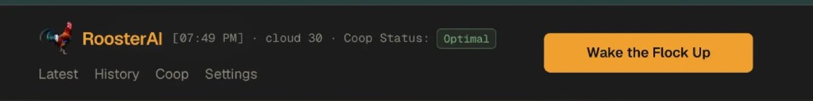
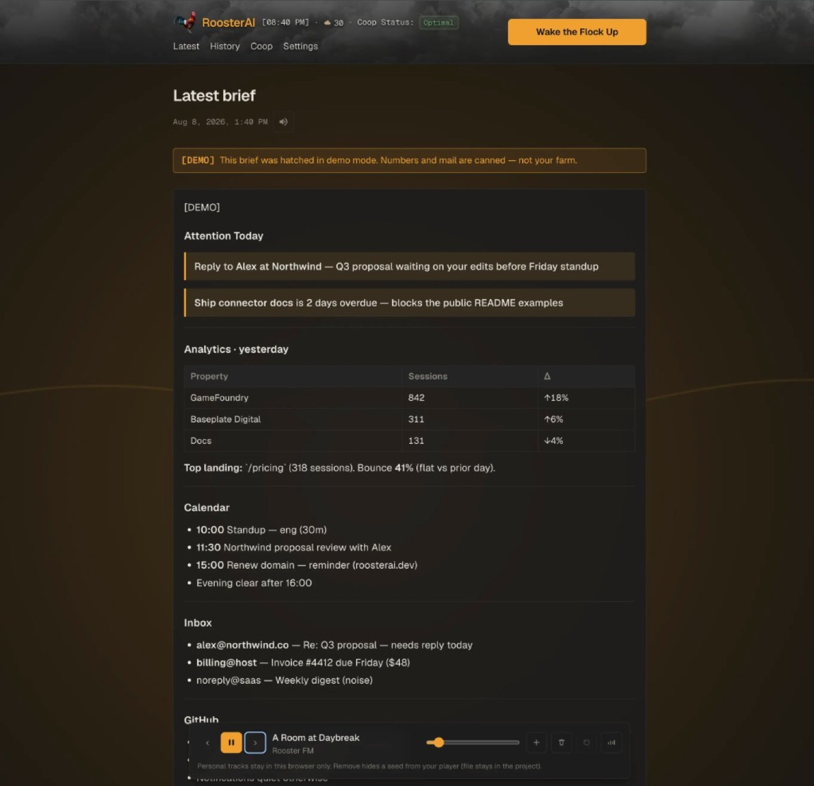
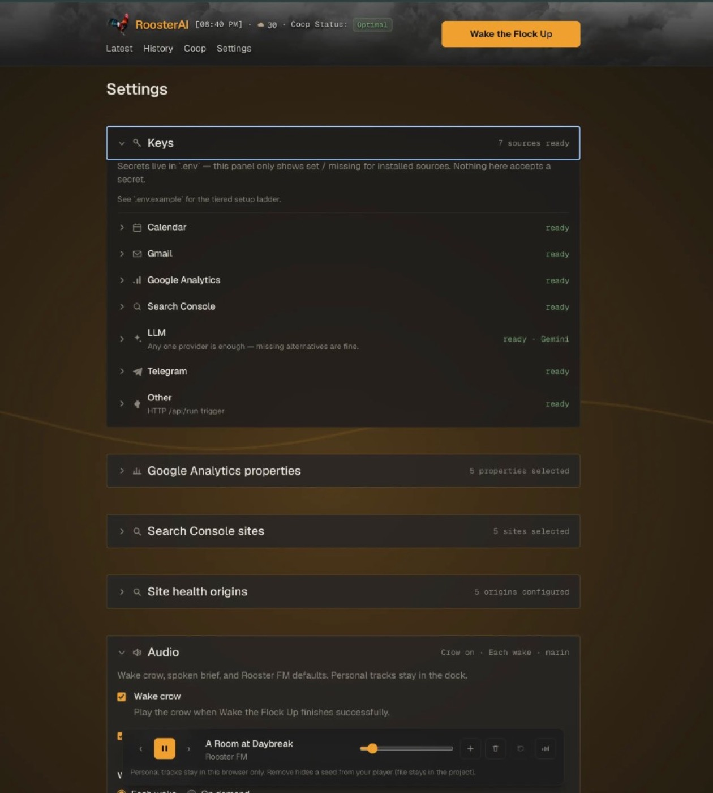

# 🐓 RoosterAI

Why check four apps when one bird do trick.

RoosterAI is a self-hosted morning briefing agent that wakes up before you do, pecks through your sources, and crows a clean, AI-summarized digest straight to your phone.

No multi-tenant SaaS. No tracking. No subscription fees. Just a loud bird doing the chores while you sleep.

```
┌────────────────────────────────────────────┐
│   apps checked manually     4 tabs, 45 min │
│   apps checked by rooster   1 msg, 30 sec  │
│   coffee temperature        hot            │
│   vibes                     EARLY BIRD     │
└────────────────────────────────────────────┘
```

[Watch the demo Short on YouTube](https://youtube.com/shorts/5tprDtKMyB0)

## Under the hood / Dashboard

You do not have to live in raw JSON. The local dashboard is the control surface — stock connectors, check key status, pick GA4 properties, tune prompts, and read the brief. Secrets stay in `.env`; preferences write to `rooster.config.json`.

Dark, glassy UI with a live clock, optional weather backdrop, **Coop Status**, and **Wake the Flock Up** on every page.

<table>
  <tr>
    <td width="50%" valign="top">
      <p><strong>Header</strong> — nav (Latest, History, Coop, Settings), coop health, and the primary wake action. Weather layers in when configured.</p>
      
    </td>
    <td width="50%" valign="top">
      <p><strong>Status strip</strong> — same shell on a flat background: time, weather readout, and Coop Status badge.</p>
      
    </td>
  </tr>
  <tr>
    <td width="50%" valign="top">
      <p><strong>Latest brief</strong> — action-first digest with <strong>Attention Today</strong> callouts, section tables (analytics, calendar, inbox, and more), optional spoken playback, and the Rooster FM dock.</p>
      
    </td>
    <td width="50%" valign="top">
      <p><strong>Settings</strong> — accordion panels for key readiness (never values), GA4 / Search Console / site-health picks, plus Audio (wake crow, TTS cadence, Rooster FM).</p>
      
    </td>
  </tr>
</table>

Scroll below the brief on **Latest** for **Pecks** (quiet follow-up chips), **Ask** (evidence-grounded chat), **Recent chats**, and **Connector outcomes** — raw per-source payloads before the LLM synthesis. **Preferences** (LLM, delivery, timezone, prompts) live in the open panel at the bottom of Settings.

## Pecks + Ask

Two separate objects:

| Object | What it is |
|--------|------------|
| **Brief + Pecks** | Durable morning snapshot and 0–3 stable questions for *that* brief |
| **Chat threads** | Independent exploration at `/ask/[id]`; context frozen at creation |

**Pecks** appear under the brief prose (heading **Pecks**, hint *Questions worth asking about this brief*). First click on a chip creates a chat; later clicks reopen that same Peck + source-brief thread. Free-form Ask always starts a new thread. Calm mornings may show fewer or zero chips (the section hides when empty). Demo / stub wakes use canned showcase pecks.

**Ask** digs deeper than rephrasing the prose. Each thread freezes `contextBriefIds` (source brief + preceding substantive briefs, default up to 7) and `contextWeeklyIds` (successful weeklies with `weekEnd` on/before the source day, default up to 4) so later wakes do not silently change yesterday’s chat. Answers stay plain; the UI links source brief and week pages under each reply via explicit citation markers (not substring ID matching). History rows also open `/brief/[id]`; weekly archive is `/weeks`.

Ask requires a **real LLM** with credentials. Stub / demo-only modes show Pecks but **disable Ask** (no silent stub answers). You can also turn either feature off independently in `rooster.config.json`:

| Knob | Default | Notes |
|------|---------|--------|
| `pecksEnabled` | `true` | Skip pecks generation on wake when false |
| `askEnabled` | `true` | Hide Ask entry when false |
| `chatContextBriefs` | `7` (max 7) | Briefs frozen into a new chat |
| `chatContextWeeks` | `4` (max 12) | Successful weeklies frozen into a new chat |
| `pecksTimeoutMs` | `20000` | Fail-soft; wake continues on timeout |
| `askTimeoutMs` | `60000` | Per Ask turn |
| `askMaxUserMessageChars` | `4000` | Request limit |
| `askMaxAssistantChars` | `8000` | Soft reply cap |
| `askContextCharBudget` | `24000` | Evidence budget (~45% source brief / ~35% weeklies / ~20% neighbors) |
| `chatMaxStoredMessages` | `40` | Older turns pruned |

TTS sign-offs are unchanged — pecks are never spoken.

## Weekly memory

One `WeeklyRecord` powers machine memory and the human page at `/week/[id]`. Structured `signals` + `carryForward` are canonical; `text` is **deterministically rendered** from them (never LLM prose alongside). Weeks are Monday–Sunday in `config.timezone` (ids like `2026-08-03` / `2026-08-03.demo`).

Generation is a **lazy idempotent backfill** on wake: after the daily brief is persisted and delivery is attempted, the weekly stage runs fail-soft under one shared `weeklyTimeoutMs` budget (max **2** provider attempts per wake). Source evidence is in-week briefs by local `createdAt` — digest + outcomes only (unchanged wakes keep their own id/digest; no `resolveSubstantiveBrief`). Identical digests are grouped so multi-day persistence is visible to the model.

| Knob | Default | Notes |
|------|---------|--------|
| `weeklyEnabled` | `true` | Gate generation |
| `weeklyTimeoutMs` | `30000` | Entire weekly stage (all backfills) |
| `weeklyRetryHours` | `24` | Cooldown after failed LLM/parse |
| `weeklyRetentionWeeks` | `12` | Prune successful weeks per demo/real lane |

Failed attempt records stay on disk for cooldown but are **hidden** from `/weeks`. Demo / stub wakes write a canned fixture without a live weekly JSON call.

Offline checks for digest grouping, unchanged cross-week baseline, lease, retention, Ask markers, and budget split:

```bash
npx tsx scripts/verify-weekly.ts
```

## Tier 0 — hatch a demo brief (no keys)

```bash
git clone https://github.com/royboy1990/-RoosterAI
cd RoosterAI
npm install
npm run wake -- --demo
npm run dev
```

Open [http://localhost:3000](http://localhost:3000). First run lands on **Stock the Coop** (`/coop`) — pick sources, or hit **Just show me the demo**. You should see a labeled `[DEMO]` brief — canned data, stub LLM, file delivery. Same pipeline as a real run; zero network, zero secrets. Demo briefs include sample **Pecks**; **Ask** stays disabled until a real LLM key is configured.

Primary action everywhere: **Wake the Flock Up** (`npm run wake`).

For screenshots / marketing without running connectors, seed the polished showcase brief anytime:

```bash
npm run demo:showcase
# or without the [DEMO] banner:
npm run demo:showcase -- --clean-label
```

Then open Latest on the dashboard.

## Rooster FM

Ambient morning radio behind the dashboard (dawn field + dock). Two compressed seed tracks ship with the repo so playback works out of the box.

| What | Where it lives |
|------|----------------|
| **Seed beds** | `public/audio/A_Room_at_Daybreak.mp3`, `public/audio/Window_Seat_Sunrise.mp3` (committed, ~1.7 MB each) |
| **Your extra tracks** | This browser only (IndexedDB) — never the git repo |

### Add personal tracks

1. Start the dashboard (`npm run dev`) and open the bottom **Rooster FM** dock.
2. Click **Add**, or **drag and drop** MP3s onto the dock.
3. Prev/next cycles the seed tracks plus anything you added.
4. **Remove** hides the current track from your player. Personal tracks are deleted from this browser; seed beds stay in the repo and can be brought back with **Restore seeds**.

Personal audio is not uploaded and is gitignored under `public/audio/*` (except the seed files and README). Keep files under ~25 MB each.

See also [`public/audio/README.md`](./public/audio/README.md).

## Spoken brief (TTS)

Optional OpenAI speech so the Latest brief can be listened to on the dashboard (separate from Rooster FM beds).

| What | Detail |
|------|--------|
| **Model** | `gpt-4o-mini-tts` via `POST /v1/audio/speech` |
| **Key** | Same `OPENAI_API_KEY` — speech always hits `api.openai.com` (not a custom `OPENAI_BASE_URL` chat host) |
| **When** | Settings → Audio: **each wake** (default) or **on demand** from the Latest play control |
| **Voice** | 13 built-ins with in-settings preview; optional **Your name** for daypart greetings / sign-offs |
| **Files** | `data/audio/<brief-id>.mp3` (gitignored, local only) |

Wake still succeeds if TTS fails (logged; brief text delivery continues). Dashboard playback only for now — not Telegram voice.

## Onboarding ladder

| Tier | What you add | Command |
|------|----------------|---------|
| **0** 🥚 | Nothing (demo) | `npm run wake -- --demo` |
| **1** 🐣 | GitHub + Calendar + one LLM key | copy `.env` + config, then `npm run wake` |
| **2** 🐥 | Telegram | brief hits your phone |
| **3** 🐓 | IMAP, GA4, your connectors | stock more from `/coop` |

### Tier 1 — GitHub + Calendar + one LLM key

GitHub is the lowest-friction real source for this audience (you already have an account). Calendar needs only a secret ICS URL — no API key. GA4 stays in the catalog as the advanced service-account example; install it from `/coop` only if you want it.

```bash
cp .env.example .env
cp rooster.config.example.json rooster.config.json
# edit .env: GITHUB_TOKEN + CALENDAR_ICS_URL + one of OPENAI_API_KEY / GEMINI_API_KEY / ANTHROPIC_API_KEY
# edit rooster.config.json: llm.provider / model (connectors are already sparse)
# timezone: set Asia/Jerusalem (etc.) in Settings, or leave UTC — the dashboard picks up your browser zone once
npm run wake
```

Or skip the file copy: open `/coop`, install what you want, then drop keys in `.env`.

### Tier 2 — delivery

Telegram → see **Telegram — Bot API delivery** under [Connector setup guides](#connector-setup-guides). Short version: BotFather token + chat id in `.env`, then set delivery to `telegram` in Settings.

### Tier 3 — everything else

IMAP (recent unread only — default last 48h), GA4 (service account + property picker), Anthropic/Gemini alternatives, custom connectors — stock from `/coop`, then see [CONTRIBUTING.md](./CONTRIBUTING.md) and [docs/CUSTOM-CONNECTORS.md](./docs/CUSTOM-CONNECTORS.md). Setup walkthroughs for individual connectors live below.

## Connector setup guides

<details>
<summary><strong>Calendar — secret ICS URL</strong></summary>

<br>

RoosterAI reads today's events from a secret iCalendar (ICS) feed. No OAuth, no API key — only `CALENDAR_ICS_URL`. Set your timezone in Settings (or leave `UTC` and let the dashboard adopt your browser zone). Calendar decides "today" from that IANA timezone.

① **Get a secret ICS URL**

**Google Calendar** (verified):

1. Open [calendar.google.com](https://calendar.google.com).
2. In the left sidebar, find the calendar you want in the brief (not "Other calendars" unless that is intentional).
3. Click the **three dots** next to that calendar → **Settings and sharing**.
4. Scroll to **Integrate calendar**.
5. Copy **Secret address in iCal format** — it looks like `https://calendar.google.com/calendar/ical/.../private-.../basic.ics`.
6. Use **Secret**, not the public HTML/iCal link — private events will not show on the public one.

**Apple Calendar** (not verified manually — path may vary by macOS / iCloud UI): Calendar app → right-click the calendar → Share / Get shareable link → copy the private ICS URL.

**Outlook** (not verified manually — path may vary by Outlook.com / Microsoft 365 UI): Calendar settings → Shared calendars / publish → copy the ICS link.

**Sanity check:** open the URL in a browser or `curl` it. The body should start with `BEGIN:VCALENDAR`. If you get HTML or a login page, it is the wrong link.

② **Put it in `.env`**

```env
CALENDAR_ICS_URL=https://calendar.google.com/calendar/ical/.../basic.ics
```

No quotes. Restart `npm run dev` after saving so the process reloads dotenv.

③ **Install Calendar in the Coop**

1. Open `/coop`.
2. Under **Available**, find **Calendar** → **Install**.

That records intent in `rooster.config.json` (`maxEvents` defaults to 20). If the card shows **Needs keys**, the env var is not loaded — recheck step 2 and restart.

④ **Wake and verify**

Hit **Wake the Flock Up** (or `npm run wake`). The brief should include a **Calendar** section with today's events, or `Nothing on the calendar for YYYY-MM-DD (Your/Timezone).` if the day is empty.

If it fails, check `data/rooster.log` for `calendar: fetching ICS…` and errors like `Calendar ICS fetch` or `did not return an iCalendar feed`.

</details>

<details>
<summary><strong>Telegram — Bot API delivery</strong></summary>

<br>

RoosterAI sends the finished brief with Telegram’s Bot API (`sendMessage`). You need a bot token and your personal chat id — then set delivery to Telegram. Verified path below is **Telegram Web** ([web.telegram.org](https://web.telegram.org)).

① **Create the bot (BotFather)**

1. Open Telegram Web and search **`@BotFather`** → open the chat → **Start** if needed.
2. Send `/newbot` (or use BotFather’s create-bot UI).
3. In the **New bot** form:
   - **Bot Name** — display name (e.g. `RoosterAI`)
   - **About** — optional
   - **Username** — must end in `bot` (e.g. `rooster_ai_bot` → `@rooster_ai_bot`)
4. Click **CREATE BOT**.
5. BotFather shows a popup with your bot and the **HTTP API token**. Click **Copy**. That string is `TELEGRAM_BOT_TOKEN`.
6. Close the popup.

Keep the token private — anyone with it can control the bot. Prefer **Copy** over screenshotting.

② **Open a chat with your bot (required)**

BotFather does not leave you inside the bot chat. After you close the popup:

1. In Telegram Web search, type the **username you chose** (e.g. `rooster_ai_bot` or `@rooster_ai_bot`).
2. Open that chat → **Start** (or send `hi`).

Until you do this, Rooster has nowhere to deliver.

③ **Get your chat id**

For a private chat, `TELEGRAM_CHAT_ID` is **your** Telegram user id (digits), not the bot’s username.

**Reliable (Telegram Web):**

1. Search **`@userinfobot`** (or **`@getidsbot`**).
2. Open it → **Start**.
3. Copy the numeric **Id** it replies with → that is `TELEGRAM_CHAT_ID`.

**Optional fallback:** after step ②, open  
`https://api.telegram.org/bot<YOUR_BOT_TOKEN>/getUpdates`  
in a browser and look for `"chat":{"id":…}`. If `result` is `[]` or the page is unhelpful, ignore this method and use `@userinfobot`.

④ **Put secrets in `.env`**

```env
TELEGRAM_BOT_TOKEN=123456:ABC-DEF...
TELEGRAM_CHAT_ID=123456789
```

No quotes. Restart `npm run dev` after saving so the process reloads dotenv.

⑤ **Switch delivery to Telegram**

Dashboard → **Settings** → **Delivery** → **Telegram** → save  
(or set `"delivery": { "channel": "telegram" }` in `rooster.config.json`).

Settings → Keys should show Telegram as **ready** once both env vars load.

⑥ **Wake and verify**

Hit **Wake the Flock Up** (or `npm run wake`). The brief should appear in the bot chat on Telegram Web / mobile. A copy still lands under `data/briefs/` as usual.

If it fails, check `data/rooster.log` for `telegram: sendMessage` and the API error text. Classic issues: delivery still set to `file`, never pressed **Start** on the bot, wrong chat id, or `npm run dev` not restarted after editing `.env`.

</details>

<details>
<summary><strong>GA4 — service-account authentication</strong></summary>

<br>

To set up GA4 service-account authentication, connect a Google Cloud project to your existing Google Analytics property so RoosterAI can securely request data. Since you already have a GA4 property, here is the exact process to generate the credentials and link them up:

① **Find your GA4 Property ID** (optional if you use the in-app picker)

1. Open [Google Analytics](https://analytics.google.com/) and select your website's property.
2. Go to **Admin** (the gear icon at the bottom left).
3. Under the **Property** column, click **Property Settings**.
4. Copy the **PROPERTY ID** (a string of numbers). Optional fallback: `GA4_PROPERTY_ID` in `.env` (comma-separated for several). Prefer selecting properties in **Settings** / **Setup** after the service account can list them.

② **Enable the GA4 APIs in Google Cloud**

1. Go to the [Google Cloud Console](https://console.cloud.google.com/).
2. Create a new project (or select an existing one).
3. Open the navigation menu (hamburger icon) and go to **APIs & Services > Library**.
4. Search for **Google Analytics Data API** (reports), click it, and hit **Enable**.
5. Repeat for **Google Analytics Admin API** (property picker list) — enable that too.

③ **Create the Service Account & JSON Key**

1. In the Cloud Console, go to **APIs & Services > Credentials**.
2. Click **+ CREATE CREDENTIALS** at the top and select **Service account**.
3. Give it a name (e.g., `ga4-api-reader`) and click **Create and Continue**, then **Done** (you can skip the optional roles).
4. You will now see the Service Account listed. Copy the email address for this account (it ends in `iam.gserviceaccount.com`). You need this for the next step.
5. Click on the Service Account you just created.
6. Go to the **Keys** tab at the top.
7. Click **Add Key > Create new key**.
8. Select **JSON** and click **Create**. The file will download to your computer.

④ **Grant the Service Account access to GA4**

1. Head back to [Google Analytics](https://analytics.google.com/).
2. Go to **Admin > Property Access Management** (under the **Property** column).
3. Click the blue **+** icon in the top right and select **Add users**.
4. Paste the Service Account email address you copied in Step 3.
5. Under **Standard roles**, select **Viewer**.
6. Click **Add** in the top right.

⑤ **Configure your Environment**

1. Rename the downloaded JSON key file to `ga4-service-account.json`.
2. Move this file into the project root (alongside your `.env` file).
3. Update your `.env`:

```env
# Optional fallback if you skip the Settings property picker:
# GA4_PROPERTY_ID=123456789
GOOGLE_APPLICATION_CREDENTIALS=./ga4-service-account.json
```

Once this is set up, the app uses the JSON key to authenticate silently as the service account, which now has **Viewer** permissions to read your GA4 data. Stock the GA4 connector from `/coop` if it is not already installed, then pick properties under Settings (Admin API must be enabled for the list to load).

</details>

<details>
<summary><strong>Search Console — same service account</strong></summary>

<br>

GSC reuses `GOOGLE_APPLICATION_CREDENTIALS` (same JSON key as GA4). No second secret blob.

① **Enable the Search Console API**

1. In [Google Cloud Console](https://console.cloud.google.com/) → **APIs & Services > Library**, search for **Google Search Console API** and **Enable** it on the project that owns your service account key.

② **Add the service account to each GSC property**

1. Open [Google Search Console](https://search.google.com/search-console).
2. Select a property → **Settings → Users and permissions**.
3. Add the service-account email (`…@….iam.gserviceaccount.com`) with **Full** access (Restricted may be enough for read-only reports; Owner is not required).

③ **Configure**

```env
GOOGLE_APPLICATION_CREDENTIALS=./ga4-service-account.json
# Optional fallback if you skip the Settings site picker:
# GSC_SITE_URL=https://example.com/,sc-domain:example.com
```

Stock **Search Console** from `/coop`, then pick sites under Settings (or Setup when credentials are present). Wake uses the same credentials file as GA4 — no new GitHub secret.

</details>

<details>
<summary><strong>Site health — robots.txt + sitemaps</strong></summary>

<br>

No API key. Install **Site health** from `/coop`, then in Settings list absolute origins (one per line, e.g. `https://example.com`). Optional label: `Blog | https://blog.example.com`. Each wake fetches `/robots.txt` and a few listed sitemaps.

</details>

## How it works

```
[Cron / dashboard / curl]
       │
       ▼
   src/core/run.ts  ──> connectors (GitHub, Calendar, IMAP, GA4, GSC, Site health, yours)
       │
       ▼
   sanitize + LLM  ──> terse executive brief
       │
       ▼
   optional Pecks  ──> 0–3 grounded questions (fail-soft; not spoken)
       │
       ▼
   optional TTS    ──> data/audio/<id>.mp3 (OpenAI speech; fail-soft)
       │
       ▼
   Telegram / file ──> data/briefs/<timestamp>.json + phone
       │
       ▼
   weekly backfill ──> data/weeks/<monday>.json (fail-soft; max 2 / wake)
```

Ask threads live separately under `data/chats/` with frozen `contextBriefIds` + `contextWeeklyIds` — not rewritten when a new wake lands.

After gathering, Rooster compares today’s digest to the last usable brief — unchanged mornings skip the LLM; otherwise the model still writes a full morning brief (with a short memory packet when something moved). Handy if you Wake more than once a day: you still get a morning brief, not a rewrite of the same digest.

Core lives in `src/core/**` as pure TypeScript (no Next.js imports), so crontab can run `npm run wake` with no server. The dashboard imports the same code.

The Latest page renders the brief as a small safe dialect (headings, bold, lists, `!!!` urgent callouts, markdown tables) — not free-form HTML. The system prompt lists what the model may use.

Core does **not** scrape the web or drive a headless browser. Those stay in your fork — see [docs/CUSTOM-CONNECTORS.md](./docs/CUSTOM-CONNECTORS.md).

## Scheduling

See [docs/SCHEDULING.md](./docs/SCHEDULING.md) for crontab, GitHub Actions, and the token-protected `POST /api/run` HTTP trigger.

### GitHub Actions

Starter workflow: [`.github/workflows/wake.yml`](./.github/workflows/wake.yml). It runs `npm run wake` on a UTC cron (edit the expression) or via **Actions → Run workflow**.

After your `.env` keys are filled:

```bash
npm run generate:wake-workflow
```

That rewrites the workflow’s `env:` block from `.env` — **only set keys are mapped**; missing ones are omitted. Then add the printed names under repo **Settings → Secrets and variables → Actions**, commit the workflow, and push.

Notes:
- Local **Wake the Flock Up** / `npm run wake` do not need Actions.
- GitHub’s built-in `GITHUB_TOKEN` collides with the connector — the generator maps it from secret `ROOSTER_GITHUB_TOKEN`.
- `rooster.config.json` is gitignored; either commit a non-secret copy or set secret `ROOSTER_CONFIG_JSON`.

### HTTP trigger (`POST /api/run`)

Generate a long random `ROOSTER_RUN_TOKEN` yourself and put it in `.env` (the route returns 503 if unset):

```bash
openssl rand -hex 32
# then in .env: ROOSTER_RUN_TOKEN=<paste>
```

Local **Wake the Flock Up** / `npm run wake` do not need this token.

## Config vs secrets

- **Secrets** → `.env` only (gitignored). Dashboard shows set/missing for **installed** sources, never values, never accepts secret inputs.
- **Secret scan** → `npm run check:secrets` (also runs on PR/push via GitHub Actions) looks for known token shapes so keys do not land in the tree.
- **Preferences** → `rooster.config.json` (gitignored; copy from `rooster.config.example.json`, or let `/coop` create it). Sparse `connectors[]` — installed only. Model, delivery, timezone, schedule hint, operator name, TTS prefs, and briefing prompts live on Settings.
- **Timezone** → IANA string in config (e.g. `Asia/Jerusalem`). Used for the header clock, calendar “today”, GA4 day boundaries, and spoken daypart greetings. If still `UTC`, the dashboard adopts your browser zone once; Settings also has **Use browser timezone**.
- **Local-only (never commit)** → `.env`, `rooster.config.json`, `data/` (briefs + chats + weeks + spoken MP3s), `*ga4-service-account.json`, plus IDE agent files `AGENTS.md` / `CLAUDE.md`.

## A note from the coop

Written with AI code assistants. The tools peck out the boilerplate; the rooster keeps the code clean.

## License

MIT — see [LICENSE](./LICENSE).
